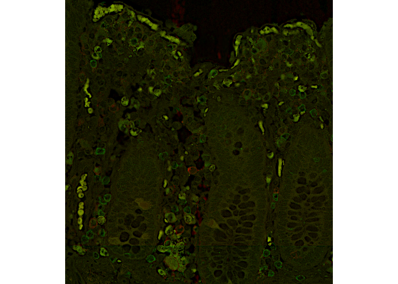
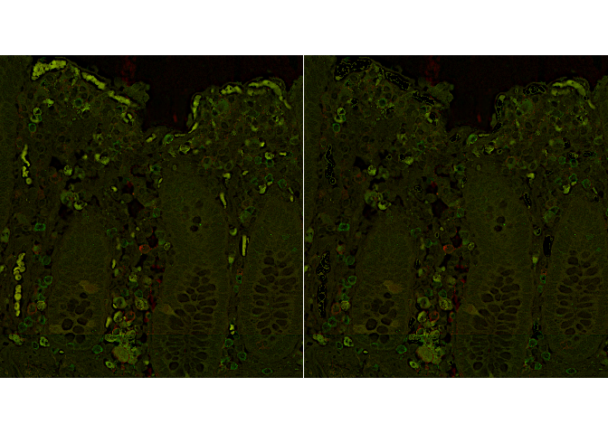

<!-- README.md is generated from README.Rmd. Please edit that file -->

# AFremover

Autofluorescence is a long-standing problem that has hindered
fluorescence microscopy image analysis. To address this, we have
developed a method that identifies and removes autofluorescent signals
from multi-channel images post acquisition.

## Installation

``` r
library(devtools)
devtools::install_github("ellispatrick/AFremover")
```

## A quick example

Suppose we have a data with 100 rows and 10 variables, and we wish to
perform an exhaustive variable selection using the classical logistic
model. Exhaustive variable selection is known to be time consuming, so
this might take a long time. APES is a variable selection method that
first converts the logistic model into a linear model first and then
uses a best-subset algorithm (such as leaps or mixed integer
optimisation) to search for the best linear model to obtain the best
variables. These selected variables in the linear space then represents
the best model for the original logistic model.

The application of APES is not restricted to logistic model but to all
GLMs.

``` r
library(AFremover)
## Read in images.
imageFile1 = system.file("extdata","image1.tif", package = "AFremover")
imageFile2 = system.file("extdata","image2.tif", package = "AFremover")
im1 <- EBImage::readImage(imageFile1)
im2 <- EBImage::readImage(imageFile2)

## Transform the image.
im1 = im1/max(im1)
im2 = im2/max(im2)

combined <- EBImage::rgbImage(green=im1, red=im2)
EBImage::display(combined, all = TRUE, method = 'raster')
```

<!-- -->

``` r


## Create masks using EBImage.

# Find tissue area
tissue1 = im1 > 2*min(im1)
tissue2 = im2 > 2*min(im2)

# Calculate thresholds
imThreshold1 <- mean(im1[tissue1]) + 2*sd(im1[tissue1])
imThreshold2 <- mean(im2[tissue2]) + 2*sd(im2[tissue2])

# Calculate masks.
mask1 <- EBImage::bwlabel(im1 > imThreshold1)
mask2 <- EBImage::bwlabel(im2 > imThreshold2)

# Calculate intersection mask
mask <- EBImage::bwlabel(mask1>0&mask2>0)

## Calculate textural features.
df <- afMeasure(im1, im2, mask)

## Alternatively
## Correlation only
# afMask <- afIdentify(mask, df, minSize = 100, maxSize = Inf, corr = 0.6)

## Clustering with given k
# afMask <- afIdentify(mask, df, minSize = 100, maxSize = Inf, k = 6)

## Clustering with estimated k.
afMask <- afIdentify(mask, df, minSize = 100, maxSize = Inf, k = 20, kAuto = TRUE)
#> Warning: empty cluster: try a better set of initial centers

#> Warning: empty cluster: try a better set of initial centers

#> Warning: empty cluster: try a better set of initial centers

#> Warning: empty cluster: try a better set of initial centers


## Remove autofluorescence from images
im1AFRemoved <- im1
im2AFRemoved <- im2
im1AFRemoved[afMask != 0] <- quantile(im1,0.25)
im2AFRemoved[afMask != 0] <- quantile(im2,0.25)

combinedRemoved <- EBImage::rgbImage(green = im1AFRemoved, red = im2AFRemoved)
EBImage::display(combinedRemoved, all = TRUE, method = 'raster')
```

<!-- -->

``` r

##Or
##Exclude AF ROIs

exclude1 = unique(mask1[afMask>0])
mask1Removed = mask1
mask1Removed[mask1Removed==exclude1] = 0
#> Warning in e1@.Data == e2: longer object length is not a multiple of
#> shorter object length
exclude2 = unique(mask2[afMask>0])
mask2Removed = mask2
mask2Removed[mask2Removed==exclude2] = 0
#> Warning in e1@.Data == e2: longer object length is not a multiple of
#> shorter object length
```
